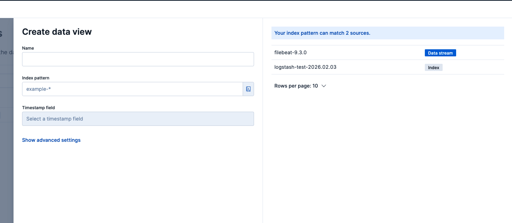

## 1. Install Filebeats sepeate EC2 Machine
```sh
wget -qO - https://artifacts.elastic.co/GPG-KEY-elasticsearch | sudo apt-key add -

sudo apt-get install apt-transport-https

echo "deb https://artifacts.elastic.co/packages/9.x/apt stable main" | sudo tee -a /etc/apt/sources.list.d/elastic-9.x.list


sudo apt-get update && sudo apt-get install filebeat
```

Run and Enable Filebeat
```sh
sudo systemctl enable --now filebeat
```


## 2. Generate Fake Logs (Simple)
Create a fake application

```sh
sudo mkdir -p /var/log/demo-app
sudo touch /var/log/demo-app/app.log
chmod 777 -R /var/log/demo-app
```

```sh
cat <<EOF > log-generator.sh
#!/bin/bash
while true
do
  echo "$(date) | level=INFO | user=user$RANDOM | action=login | status=success" >> /var/log/demo-app/app.log
  echo "$(date) | level=ERROR | user=user$RANDOM | action=payment | status=failed" >> /var/log/demo-app/app.log
  sleep 2
done
EOF
```

Run the script in background:
```sh
bash log-generator.sh &
```

### **2.1 Optional (to stop the script)**
Bring background running job to foreground:
```bash
jobs

#Output
[1]+  Running   bash log-generator.sh &
```

Bring it to foreground
```sh
fg %1
```

## 3. Configure Filebeat
```sh
sudo vi /etc/filebeat/filebeat.yml
```


```bash
filebeat.inputs:

- type: filestream
  id: demo-app-logs
  enabled: true
  paths:
    - /var/log/demo-app/*.log

setup.kibana:

  host: "https://172.31.23.242:5601"
  username: "elastic"
  password: "<password>"
  ssl.verification_mode: none

output.elasticsearch:
  hosts: ["172.31.23.242:9200"]
  preset: balanced
  protocol: "https"
  username: "elastic"
  password: "<password>"
  ssl.verification_mode: none
```

## 4. Validation
```bash
sudo filebeat test config
sudo filebeat test output
```

Output
```sh
Config OK

elasticsearch: https://172.31.23.242:9200...
  parse url... OK
  connection...
    parse host... OK
    dns lookup... OK
    addresses: 172.31.23.242
    dial up... OK
  TLS...
    security... WARN server's certificate chain verification is disabled
    handshake... OK
    TLS version: TLSv1.3
    dial up... OK
  talk to server... OK
  version: 9.3.0
```

```bash
sudo systemctl restart filebeat
sudo systemctl status filebeat
```

## 5. IN ELK, Server
```bash
curl -k -u elastic https://localhost:9200/_cat/indices?v | grep filebeat
```

Output:
```bash
  % Total    % Received % Xferd  Average Speed   Time    Time     Time  Current
                                 Dload  Upload   Total   Spent    Left  Speed
100  3150    0  3150    0     0  75071      0 --:--:-- --:--:-- --:--:-- 76829
yellow open   .ds-filebeat-9.3.0-2026.02.04-000001                               rYzNt2bESdC-TthmVbTm7Q   1   1       3106            0    757.9kb        757.9kb      757.9kb
```

