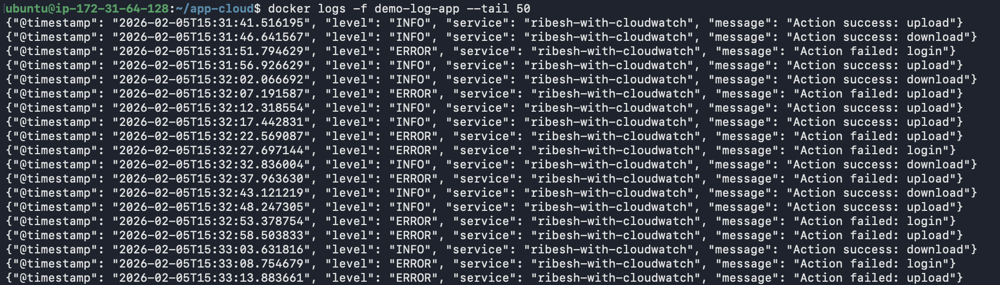
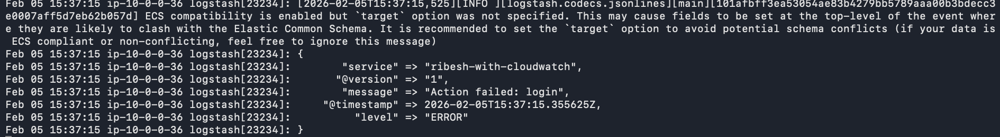
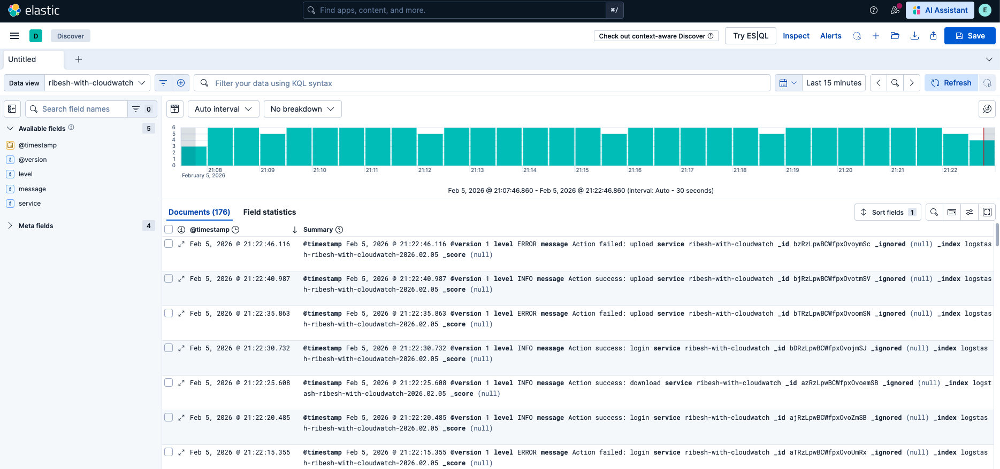
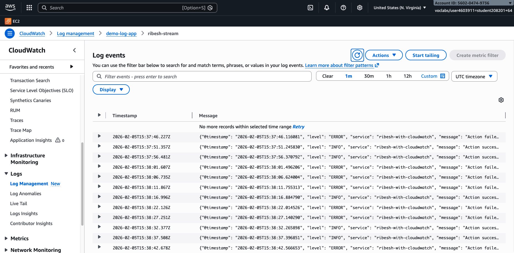

## Install AWS CLI on Application Server
```bash
sudo apt-get install unzip

curl "https://awscli.amazonaws.com/awscli-exe-linux-x86_64.zip" -o "awscliv2.zip"
unzip awscliv2.zip
sudo ./aws/install
```

## Setup AWS Credentials
```bash
mkdir ~/.aws
vi ~/.aws/credentials
```

## Verify AWS Credentials
```bash
aws configure

AWS Access Key ID [****************BYIU]: 
AWS Secret Access Key [****************Sr8W]: 
AWS Session Token [****************2w==]: 
Default region name [None]: 
Default output format [None]:
```


## Build and Run application
```bash
cd cloudwatch-app

docker compose up -d --build
```

## Verify
Docker logs
```bash
docker logs -f demo
```




Logstash
```bash
sudo journalctl -u logstash -f
```




Kibana



Cloudwatch
